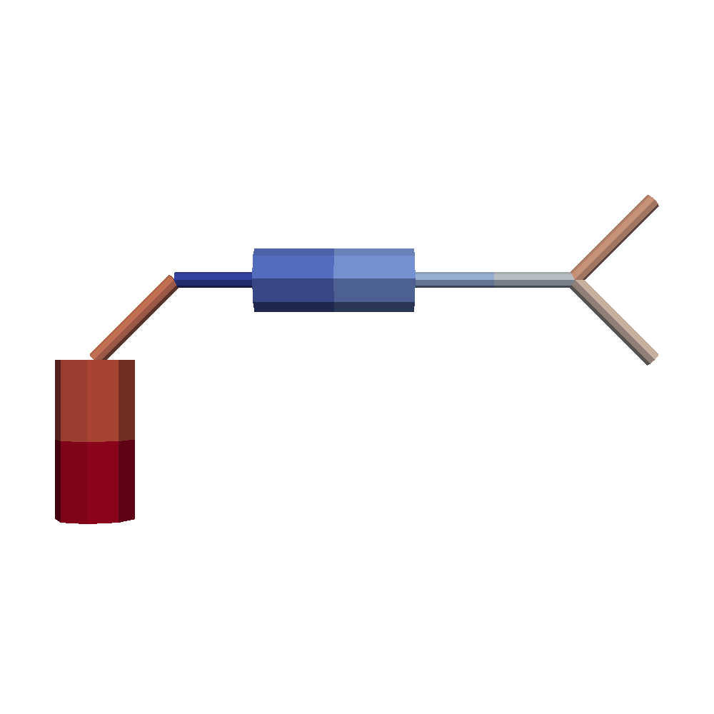
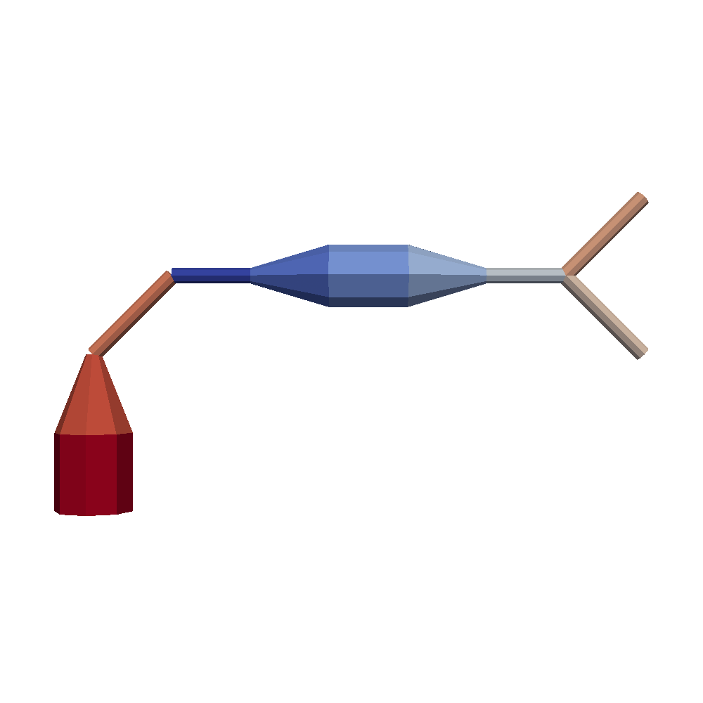

Draw Mode
=========

draw_mode indicate quality of visualization of SWC compartment.

Sample Program
--------------

- :download:`simple.swc<../tests/simple.swc>`

.. code-block:: python

    import os
    from swc2vtk.vtkgenerator import VtkGenerator

    filename = 'simple'
    outputpos = ''

    vtkgen = VtkGenerator()
    vtkgen.add_swc(os.path.join('swc', filename + '.swc'))

    for i in range(4):
        vtkgen.set_draw_mode(i)
        vtkgen.write_vtk(os.path.join(outputpos, filename + '_draw'+str(i)+'.vtk'))

``draw_mode = 0``
-----------------

``draw_mode = 1``
------------------

.. image:: _static/simple.0001.png

``draw_mode = 2``
------------------

``draw_mode = 3`` (default)
------------------

.. image:: _static/simple.0003.png

``draw_mode = 3`` with Gourand Shading
---------------------------------------
``draw_mode = 3`` with Gourand shading by Paraview could make best quality of 3D model.

.. image:: _static/simple_filtered.0003.png
