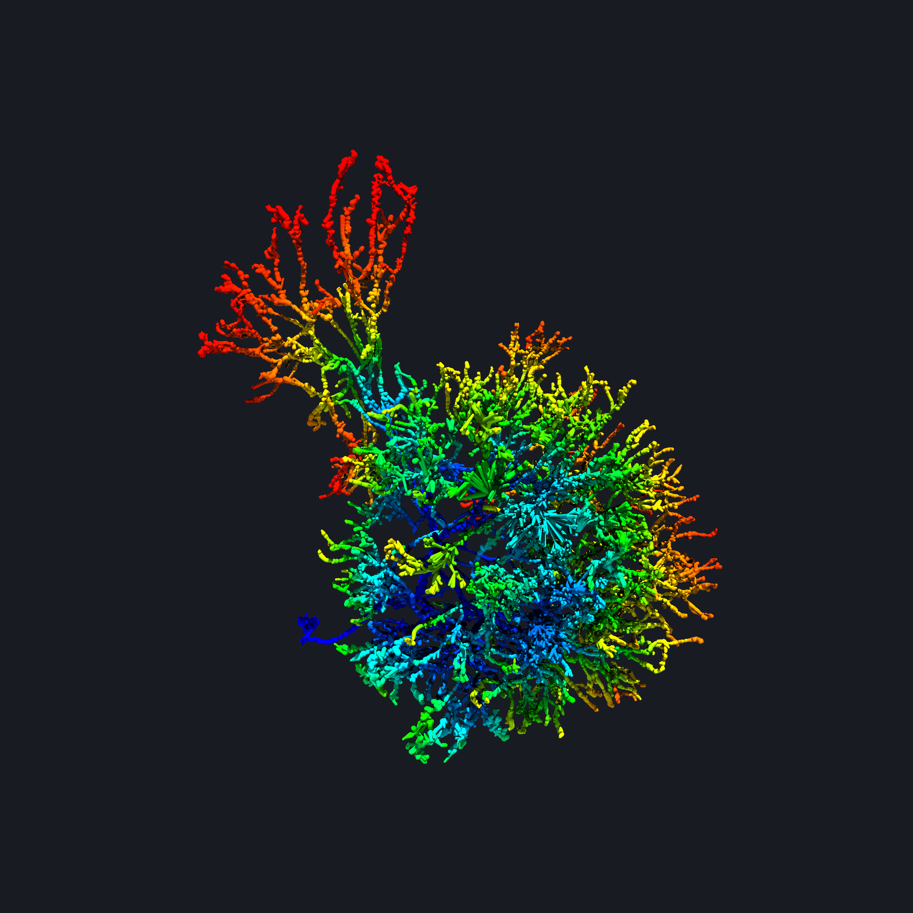

Gallery
=======

Single neuron morphology (antennal lobe neuron of silk worm moth)
-----------------------------------------------------------------

Standard brain mapped neuron simulation (LAL-VPC region of silk worm moth)
--------------------------------------------------------------------------

.. image:: _static/sb_simulation.png
