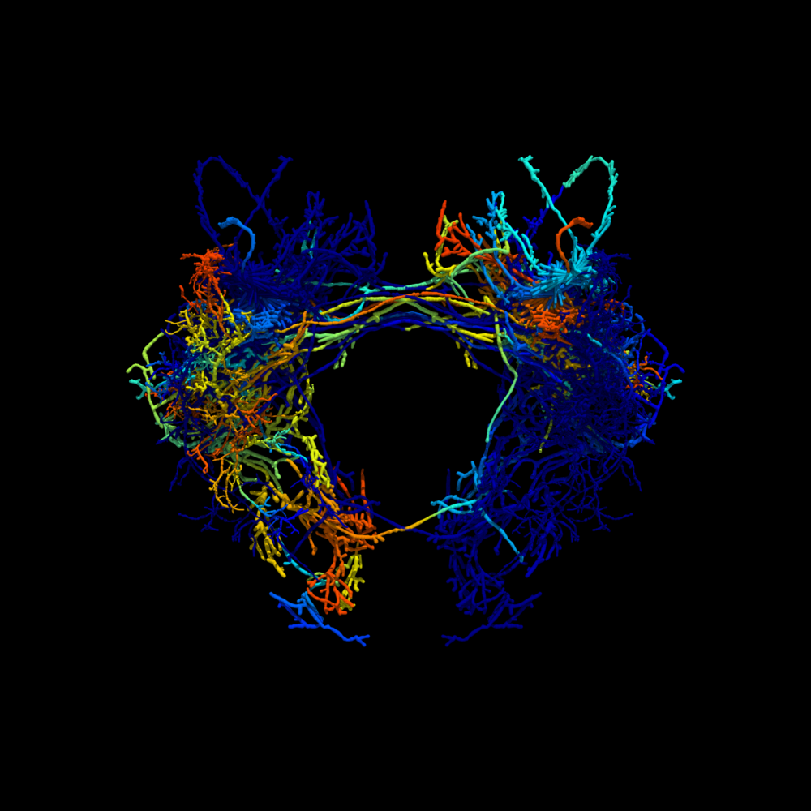

.. swc2vtk documentation master file, created by
   sphinx-quickstart on Thu Jan 19 20:56:27 2017.
   You can adapt this file completely to your liking, but it should at least
   contain the root `toctree` directive.

Welcome to swc2vtk's documentation!
===================================

.. toctree::
   :maxdepth: 2

   readme
   examples
   drawmode
   volume
   gallery
   apis/modules

Indices and tables
==================

* :ref:`genindex`
* :ref:`modindex`
* :ref:`search`

Example image
=============

