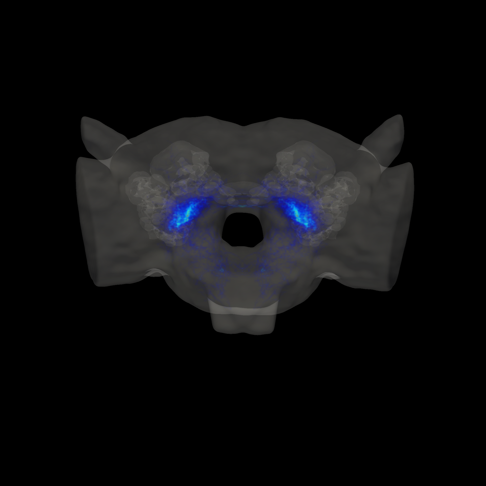

Volume Rendering
================

Output structured VTK file for volume rendering of neural circuit activity with large number of neurons.

.. note::
    this function is experimental

Sample Code
-----------

- :download:`simple.swc<../tests/simple.swc>`

.. code-block:: python

    import swc2vtk
    vtkgen = swc2vtk.VtkGenerator()
    vtkgen.add_swc('simple.swc'))
    vtkgen.write_volume_vtk('simple.vtk', origin=(-10.0, -10.0, -10.0), ratio=(1, 1, 1), div=(20, 20, 20))

Output Images
-------------

.. image:: _static/volume.png

